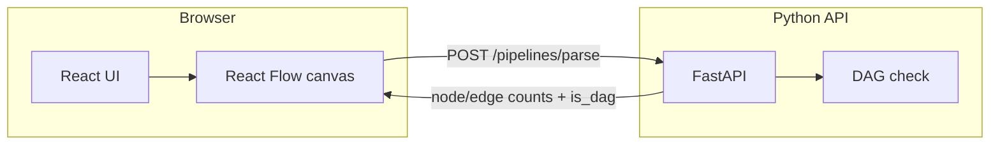
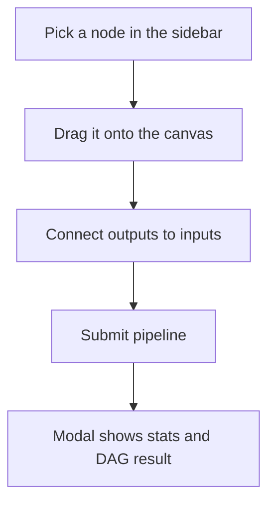

# Visual Pipeline Editor

A small full-stack app for composing **visual data pipelines** on a canvas: drag nodes from a palette, connect them with edges, and send the graph to a backend that validates structure (including **DAG detection**).

Built as a portfolio piece to show **React Flow**, a **reusable node system**, and a **FastAPI** service working together.

---

## Architecture



## How you use it



---

## Features

- **Canvas editing** — React Flow with draggable nodes, edges, and a dark, cohesive UI  
- **Extensible nodes** — shared layout wrapper (headers, handles, spacing) so new node types stay consistent  
- **Rich node set** — inputs, outputs, LLM, text (with dynamic handles), filter, prompt, database, webhook, Slack-style notification, and more  
- **Backend validation** — FastAPI endpoint counts nodes/edges and reports whether the graph is acyclic (Kahn’s algorithm)  
- **Polished UX** — result feedback in a modal (no blocking alerts), animated handles where it fits the design  

---

## Tech stack

| Layer    | Choice |
|----------|--------|
| Frontend | React 18, Create React App, **React Flow**, **Zustand** (canvas state) |
| Styling  | Plain CSS (design tokens in global styles) |
| Backend  | **FastAPI**, Pydantic, CORS for local dev |

---

## Repository layout

```
├── backend/
│   └── main.py          # FastAPI app, /pipelines/parse
└── frontend/
    ├── public/
    └── src/
        ├── nodes/       # Node components + shared BaseNode
        ├── store.js     # Zustand + React Flow helpers
        └── …            # App shell, toolbar, submit flow
```

---

## Run locally

**1. Backend** (from repo root)

```bash
cd backend
python -m venv .venv
source .venv/bin/activate   # Windows: .venv\Scripts\activate
pip install fastapi uvicorn pydantic
uvicorn main:app --reload --port 8000
```

**2. Frontend** (second terminal)

```bash
cd frontend
npm install
npm start
```

Open [http://localhost:3000](http://localhost:3000). The API expects the app origin `http://localhost:3000` (CORS is configured for that).

---

## API

| Method | Path | Purpose |
|--------|------|---------|
| `GET` | `/` | Health check |
| `POST` | `/pipelines/parse` | Body: `{ "nodes": [...], "edges": [...] }` → `{ num_nodes, num_edges, is_dag }` |

---

## License

This project is maintained for my portfolio. Use or adapt the code if it helps your own learning or prototypes.
